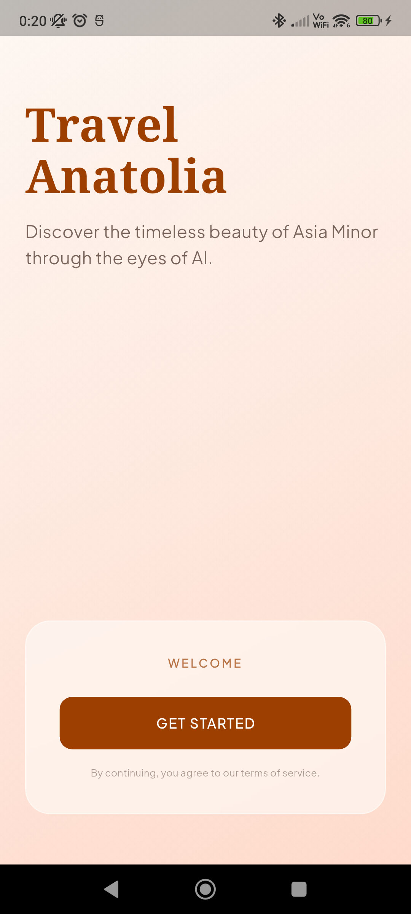

<p align="center">
  
</p>

<p align="center">
  
  
  
  
</p>

---

# 🧭 TravelAnatolia (Mobile Client)

> **Welcome to the "Silk Road" Edition of TravelAnatolia.** A high-performance, cinematic, and autonomous AI-driven travel client built with Flutter. It utilizes a custom-engineered **Stitch Design System** featuring immersive dark modes, glassmorphism panel styling, and fluid micro-animations, all powered by the robust `Agentic-Core` multi-agent backend.

Explore the historical cities, balloon-filled skies of Cappadocia, and rich cultural heritage of Anatolia through a highly personalized, AI-orchestrated mobile interface.

---

## ✨ Features & Visual Splendor

| Interface Feature | Description | Styling Architecture |
| :--- | :--- | :--- |
| 🤖 **ANA AI Concierge** | An interactive conversational companion utilizing multi-turn tool calling on `Agentic-Core`. | Immersive, fluid chat cells, dynamic status updates, and interactive maps. |
| 🗺️ **Explore Bento Grid** | A custom staggered discovery dashboard highlighting destinations, food, culture, and adventure. | Responsive grid cards with custom shadows and glassmorphic navigation accents. |
| 📋 **Itinerary Architect** | Visual timeline parsing strict Zod JSON schemas directly from the AI server. | Chronological timeline cards with custom icon badges matching each activity. |
| 👤 **Identity Profiling** | A cinematic 4-question interactive onboarding quiz matching traveler personas. | Slide-in widgets, gradient cards, and tactile feedback configurations. |
| 🔐 **Authentication** | High-fidelity auth interface featuring Google Sign-In and local Firebase emulation. | Modern glassmorphic login panel with real-time reactive routing guards. |

---

## 🎨 Stitch Design System

The TravelAnatolia mobile application is built upon **Stitch**, a bespoke design system meticulously engineered for luxury travel applications.

*   **Harmony of Colors:** Immersive obsidian-dark backgrounds (`#0B0C10`) paired with vibrant sunset orange accents (`#FC5404`), gold secondary highlights, and sleek neon border lines.
*   **Modern Typography:** Elegant and readable fonts sourced from Google Fonts, emphasizing modern title settings using **Outfit** and classical subheaders using **Cinzel**.
*   **Immersive Glassmorphism:** Custom `GlassPanel` containers combining background blur filters with semi-transparent overlays (`Colors.white.withOpacity(0.05)`) and micro-thin borders.
*   **Micro-Animations:** Seamless transitions powered by `animate_do` and custom implicit animations, creating an interface that feels responsive, premium, and alive.

---

## 📱 App Preview

Below is a preview of the high-fidelity user interface designed to provide an unparalleled user experience:

<p align="center">
  
</p>

---

## 🏗️ Technical Architecture

The mobile client adheres to clean architectural separation of concerns, divided into three robust layers:

```
┌─────────────────────────────────────────────────────────┐
│                        UI LAYER                         │
│  - Presentation Widgets (ChatScreen, OnboardingScreen)  │
│  - Stitch Design System Tokens (ThemeData, GlassPanel)  │
└────────────────────────────┬────────────────────────────┘
                             │
                             ▼
┌─────────────────────────────────────────────────────────┐
│                       LOGIC LAYER                       │
│  - Riverpod State & StateNotifier Providers             │
│  - Declarative Router Guards (GoRouter + AuthBridge)    │
└────────────────────────────┬────────────────────────────┘
                             │
                             ▼
┌─────────────────────────────────────────────────────────┐
│                       DATA LAYER                        │
│  - REST Client Services (http)                          │
│  - Local Firebase SDKs (Auth & Firestore Emulators)     │
└─────────────────────────────────────────────────────────┘
```

---

## 🚀 Getting Started

Follow these step-by-step instructions to get the mobile client compiling and running locally.

### Prerequisites

*   [Flutter SDK](https://docs.flutter.dev/get-started/install) v3.11.0 or higher
*   [Firebase CLI](https://firebase.google.com/docs/cli) installed and authenticated
*   A running instance of [Agentic-Core Backend](../Agentic-Core/README.md) (on Port `4000`)

### 1. Install Dependencies

From the `APP` folder directory, pull all the required Flutter and Dart packages:

```bash
flutter pub get
```

### 2. Configure Firebase Emulator Settings

To enable testing on physical devices or local emulators, the app directs authentication and Firestore traffic locally. Verify the IP addresses inside [lib/main.dart](file:///c:/Users/ASUS/Desktop/travelanatolia/APP/lib/main.dart):

```dart
// lib/main.dart
const String localEmulatorHost = '192.168.1.6'; // Replace with your LAN IP or 'localhost'

FirebaseFirestore.instance.useFirestoreEmulator(localEmulatorHost, 8080);
await FirebaseAuth.instance.useAuthEmulator(localEmulatorHost, 9099);
```

> [!IMPORTANT]
> Ensure your Flutter device/emulator and your development machine are connected to the same local network (Wi-Fi) if you are testing on a physical iOS or Android device.

### 3. Spin up the Firebase Local Emulators

Start the local Firestore and Authentication servers to mock backend user states offline:

```bash
firebase emulators:start
```

### 4. Run the Application

Execute the standard Flutter run command to build and launch the application:

```bash
flutter run
```

---

## ⚙️ Development & Maintenance

### Static Code Analysis

Ensure there are no compile warnings or layout issues before proposing commits. Run:

```bash
flutter analyze
```

### Decoupled Firebase Architecture

> [!NOTE]
> All legacy Cloud Functions previously located in `firebase/functions/` have been fully deprecated and removed. All intelligent multi-agent tasks, Zod parsers, and Neo4j graph operations are now cleanly offloaded to the [Agentic-Core Backend](../Agentic-Core/README.md) server running on port `4000`.

---

## 🗺️ Mobile Client Roadmap

- [x] Integrate high-fidelity Stitch dark-mode theme across all tabs.
- [x] Implement declarative auth redirects using `GoRouter` & `ChangeNotifier` bridges.
- [x] Migrate onboarding quiz to communicate with the `analyzeProfileFlow` endpoint.
- [x] Rework the ANA AI assistant provider to utilize synchronous REST calls to `travelAssistantFlow`.
- [x] Fix and resolve all deprecated icons and static code warnings.
- [ ] Add offline support for browsing cached travel itineraries.
- [ ] Implement local push notification cues for booking confirmations.
- [ ] Incorporate interactive Google Map views for travel points of interest.

---

## 📄 License

This software is a private proprietary project. All rights are strictly reserved. No part of this repository may be reproduced, distributed, or transmitted in any form without the prior written permission of **Erdem Metin**.

<p align="center" style="margin-top: 40px;">
  Made with 🧡 & ✨ for the TravelAnatolia Experience
</p>
